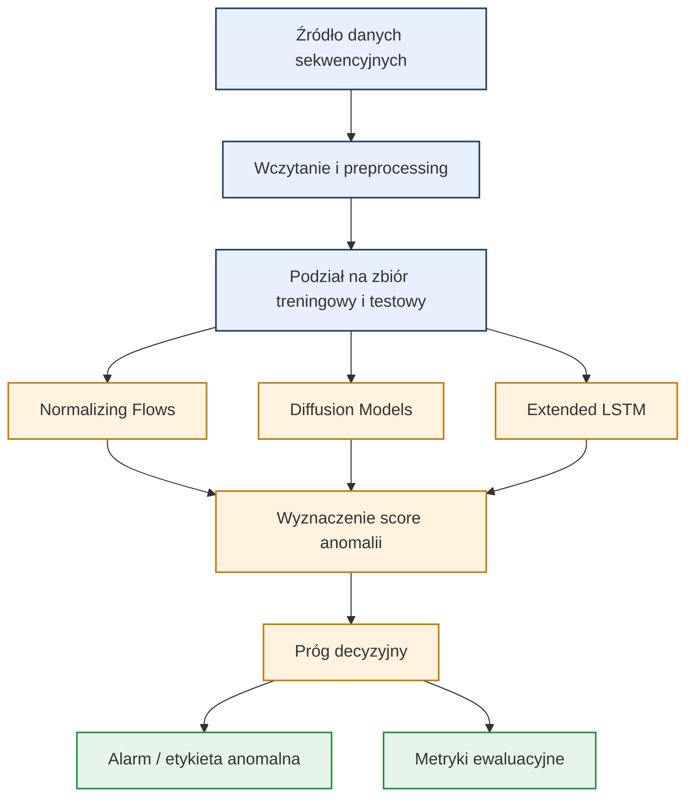

# Wykrywanie anomalii z wykorzystaniem modeli generatywnych i sekwencyjnych
## Normalizing Flows · Diffusion Models · Extended LSTM

**Dawid Zawiślak · Jakub Worek**

*System do wykrywania rzadkich i nietypowych zdarzeń w danych sekwencyjnych na podstawie wzorców normalnego zachowania.*

---

## Problem i rozwiązanie

**Problem**
- W wielu zastosowaniach dane mają charakter sekwencyjny i są trudne do ręcznej analizy, ponieważ anomalie pojawiają się rzadko, a ich forma może się zmieniać w czasie.
- Klasyczne podejścia oparte na prostych progach lub statycznych regułach często nie wychwytują subtelnych odchyleń od normalnego wzorca.
- Wykrywanie anomalii wymaga modelu, który potrafi nauczyć się rozkładu danych normalnych i wskazać obserwacje znacząco od niego odbiegające.

**Proponowane rozwiązanie**
1. Uczymy modele wyłącznie lub głównie na danych normalnych.
2. Model analizuje cechy wejściowe albo sekwencje czasowe i wyznacza miarę odchylenia od znanego wzorca.
3. Przekroczenie progu anomalii uruchamia alert lub oznaczenie próbki jako podejrzanej.
4. Porównujemy kilka rodzin modeli, aby sprawdzić, które podejście najlepiej radzi sobie z różnymi typami anomalii.

**Dla kogo:** zespoły zajmujące się monitorowaniem procesów, telemetrią, przemysłem, bezpieczeństwem systemów i analizą sygnałów.

---

## Mechanizmy AI

**Stosowane w projekcie**
- **Normalizing Flows**, np. RealNVP lub Glow, do estymacji gęstości prawdopodobieństwa i wyliczania, jak dobrze próbka pasuje do rozkładu danych normalnych.
- **Diffusion Models** do modelowania procesu rekonstrukcji lub odtwarzania danych, a następnie oceny błędu rekonstrukcji jako sygnału anomalii.
- **Rozszerzone LSTM**, np. LSTM autoencoder lub model predykcyjny, do analizy zależności czasowych i wykrywania nietypowych zmian dynamiki sekwencji.
- **Mechanizm progu decyzyjnego**, który zamienia wynik modelu na decyzję binarną: normalne albo anomalne.

**Nieużywane na starcie - i dlaczego**
- *Reguły ręczne / system ekspertowy* - anomalii w danych sekwencyjnych zwykle nie da się opisać kompletnym zbiorem prostych reguł.
- *Uczenie ze wzmocnieniem* - problem dotyczy klasyfikacji lub oceny sekwencji, a nie optymalizacji polityki działania.

---

## Jak system będzie działał

System będzie uczył się na danych reprezentujących normalne zachowanie badanego obiektu lub procesu. W fazie treningu model pozna typowe zależności w danych, a w fazie inferencji będzie oceniał, czy nowa obserwacja lub sekwencja mieści się w wyuczonym rozkładzie. Jeżeli model przypisze próbce bardzo niskie prawdopodobieństwo, wysoki błąd rekonstrukcji albo duże odchylenie predykcji, zostanie ona oznaczona jako anomalia. W praktyce pozwoli to wykrywać np. awarie, nieprawidłowe stany pracy lub inne nietypowe zdarzenia zanim ich skutki staną się poważne.

---

## Dataset

**Główny dataset: NASA SMAP/MSL**
- Publiczny benchmark do wykrywania anomalii w wielowymiarowych szeregach czasowych.
- Zawiera dane telemetryczne z systemów kosmicznych, w których występują zarówno normalne przebiegi, jak i oznaczone anomalie.
- Jest dobrze dopasowany do modeli sekwencyjnych, takich jak LSTM, oraz do podejść generatywnych, które uczą się rozkładu normalnych sekwencji.

**Dlaczego ten dataset**
- Ma naturalną strukturę czasową, więc dobrze pasuje do projektowanych modeli.
- Jest szeroko stosowany w badaniach nad anomaly detection, co ułatwia porównanie wyników z literaturą.
- Pozwala trenować na danych normalnych i testować zdolność modelu do wykrywania odchyleń.

**Możliwe dodatkowe dane do porównania**
- SMD (Server Machine Dataset) jako drugi benchmark dla danych przemysłowych.
- SWaT, jeśli chcemy sprawdzić działanie modelu na bardziej złożonym scenariuszu cyber-fizycznym.

---

## Architektura systemu

---

## Ocena jakości

- **AUC-ROC** - podstawowa metryka porównująca jakość detekcji anomalii.
- **Precision / Recall / F1-score** - ważne ze względu na silną nierównowagę klas.
- **Błąd rekonstrukcji lub likelihood** - pomocne przy doborze progu decyzyjnego.

---

## Stack technologiczny

- Python
- PyTorch
- NumPy
- pandas
- scikit-learn
- Matplotlib / Seaborn
- Jupyter Notebook
- Weights & Biases lub inny prosty system do śledzenia eksperymentów

---

## Zakres projektu

- Porównanie kilku podejść do wykrywania anomalii na tych samych danych.
- Dobór progu anomalii na podstawie wyników walidacyjnych.
- Analiza, które modele najlepiej radzą sobie z danymi sekwencyjnymi i dlaczego.
- Opcjonalnie: sprawdzenie działania na drugim zbiorze danych, aby ocenić uogólnianie rozwiązania.
